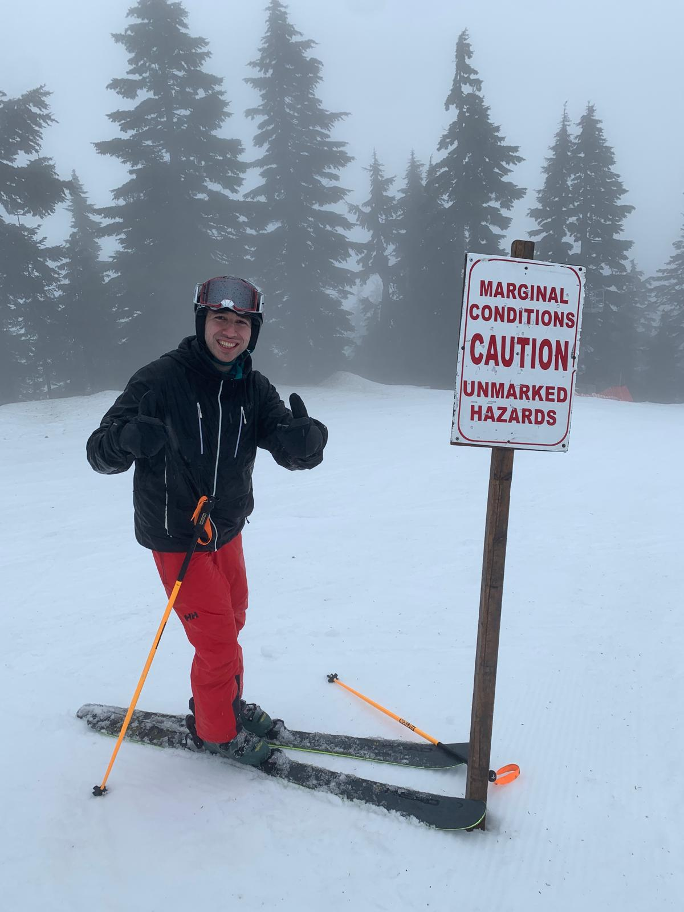

**📅 Tuesday 2nd December 2025**  
**📍 Venue:** Lecture Theatre B, Wolfson Building, Department of Computer Science, University of Oxford, UK

---

## 📝 About
We are delighted to invite colleagues, friends, and collaborators to join us in celebrating **Amin’s 30th birthday** with a day of talks, discussions, and joyful academic shenanigans.

{ width=400px }

The day will feature **short invited talks (15–30 mins)** by Amin’s friends, collaborators, and (co)admirers, interspersed with coffee breaks.  

All are welcome — whether you know Amin, his research, or simply love cake 🍰.

## 📢 Call for Talks
<s>
We invite submissions for **short talks**. Possible topics include, but are not limited to:

- Work inspired by Amin’s research (optional).  
- Serious mathematics.  
- Retrospective reflections on careers that are exactly 30 years old.  
- Nonsensical ramblings and crackpottery.  
- Any other topic you think Amin might find vaguely interesting.

**Format:** 15–30 minutes, followed by polite applause.  
**Submission deadline:** Tuesday 2nd December 2025.  

Preparation is discouraged but not forbidden.
Acceptance is essentially guaranteed and this is a great opportunity to elevate your academic profile!
</s>

The Call for Talks is now closed. Thank you to everyone who submitted!

---

## 🕒 Programme

| Time        | Session                                             |
|------------:|---------------------------------------------------------|
| 10:30–11:30 | Nihil Shah                                          |
| 11:30–12:00 | Ralph Sarkis                                        |
| 12:00–14:00 | 🍽 Lunch                                            |
| 14:00–14:30 | Jack Liell Cock                                     |
| 14:30–15:00 | Nick Hu                                             |
| 15:00–15:30 | ☕ Break                                            |
| 15:30–16:00 | Zev Shirazi                                         |
| 16:00–17:00 | TBC                                                 |
| 17:00–17:05 | 🎭 Retrospective: celebrating Amin’s career so far  |

---

## 🎙 Invited Speakers

> *(Speakers and abstracts to follow.)*

---

## 🖊 Registration
Just turn up on the day, whenever you can make it! No registration fee.

---

## 🏛 Venue & Travel
**Robert Hooke Building**, Department of Computer Science, University of Oxford.  

- **Public transport:** Oxford train station, local buses.  
- **Parking:** Limited on-site; we recommend train/bus.  
- **Accommodation:** Nearby hotels / university guest rooms / Amin's house.

---

## 👩‍💻 Organisers
- [Zev Shirazi](https://www.cs.ox.ac.uk/people/zev.shirazi/), Department of Computer Science, University of Oxford
- [Jack Liell-Cock](https://jackliellcock.com/), Department of Computer Science, University of Oxford
- [Katherine Tourigny](https://eng.ox.ac.uk/people/katherine-tourigny), Nuffield Department of Clinical Neurosciences, University of Oxford
- [Jessica Richards](https://www.cs.ox.ac.uk/people/jessica.richards/), Department of Computer Science, University of Oxford
- [Nick Hu](https://nickx.hu/), School of Computer Science, University of Birmingham
- [Nihil Shah](https://www.cst.cam.ac.uk/people/nas54), Department of Computer Science and Technology, University of Cambridge

---

*ℹ️ This page is a draft. Please check back for updates (speakers list, abstracts, logistics).*

